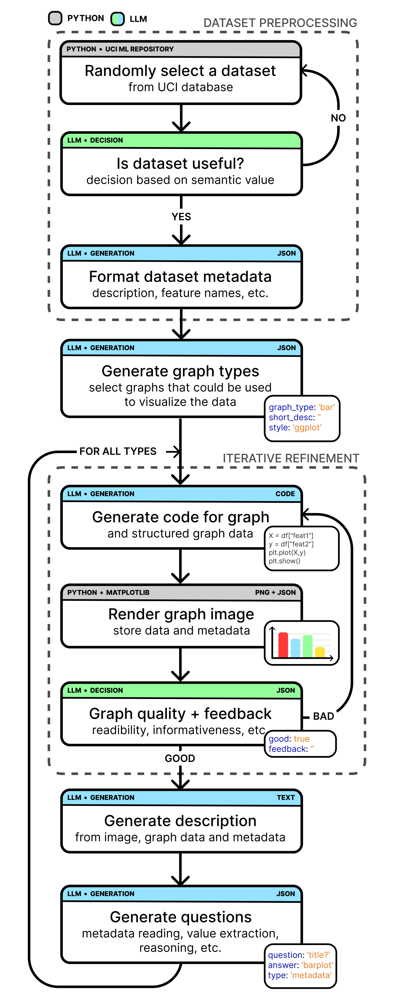
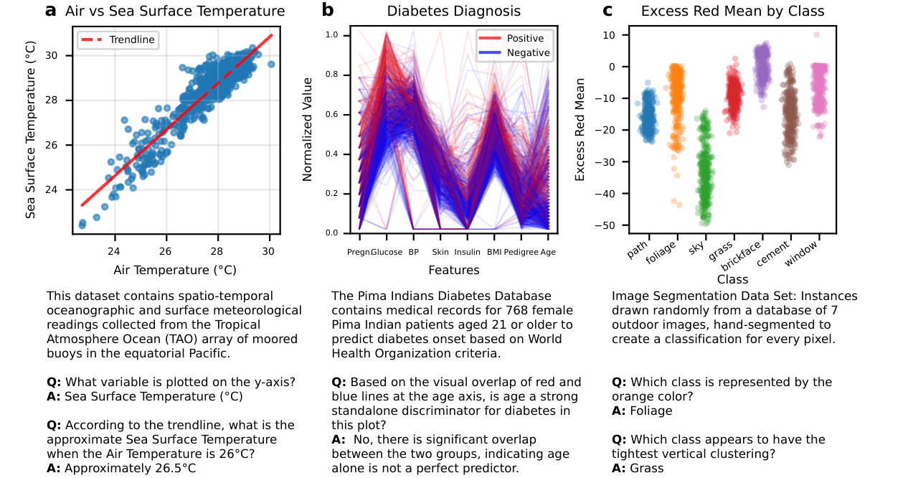

# Chart Generation

This repository contains a structured LLM-driven workflow for generating statistical figures from tabular data, together with tools to inspect the resulting dataset.

## Project schematic

The repository is organized as a simple pipeline schematic:

1. `generation_pipeline/` generates chart proposals, visualization code, and metadata from tabular datasets.
2. Generated charts are rendered into example figures and saved alongside structured metadata.
3. `dataset-viewer/` lets you browse example figures, inspect each generation iteration, and review question-answer evaluation results.

### Pipeline schematic

The pipeline schematic illustrates the staged generation workflow from dataset selection, through LLM-driven plot proposal and code generation, to final chart rendering and question-answer evaluation. It shows how dataset semantics, graph planning, visual quality review, and QA generation fit together.

### Example output figures

The example figure shows selected generated charts together with their associated questions. It demonstrates the kind of visualizations produced by the pipeline and how the generated questions are aligned with the rendered charts.

## Dataset Access

An interactive viewer for the generated dataset is available at
<https://llm-chart-generation.streamlit.app>.

The raw static data used by the viewer is available from the Biolab file server
at <https://file.biolab.si/llm-chart-generation/>. The server includes the
global manifest and chart index, plus per-chart metadata, model results, and
images.

## Directories

### `generation_pipeline/`

The dataset generation pipeline. Given tabular data, it runs a staged workflow — dataset selection, plot proposal, iterative visual refinement, and aligned question-answer generation — producing chart images and structured metadata. Key entry points:

- `generation_job.py` — main generation script
- `evaluation_job.py` / `evaluation_online.py` — benchmarking generated QA pairs against models
- `render_chart_from_metadata.py` — re-renders charts from saved metadata and produces example figure outputs
- `join_metadata.py` — merge split metadata files into a single `metadata.jsonl`
- `model_scripts/` — training and inference utilities for the connector/VLM stack

See `generation_pipeline/README.md` for setup and usage.

### `dataset-viewer/`

A Streamlit app for browsing the generated dataset. Displays the 2,228 charts with per-iteration images, generation feedback, code, questions, and per-model evaluation results. The public instance is available at <https://llm-chart-generation.streamlit.app>. See `dataset-viewer/README.md` for setup and usage.
